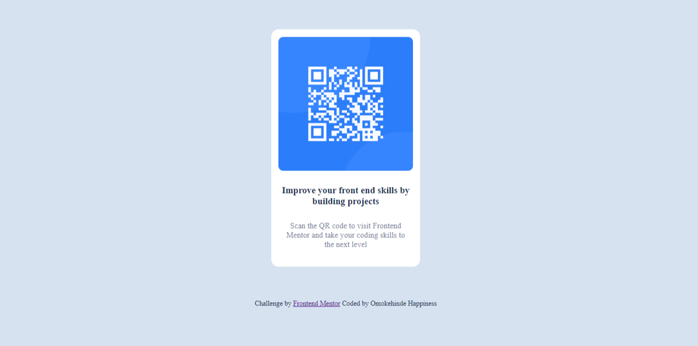

# Frontend Mentor - QR code component solution

This is a solution to the [QR code component challenge on Frontend Mentor](https://www.frontendmentor.io/challenges/qr-code-component-iux_sIO_H). Frontend Mentor challenges help you improve your coding skills by building realistic projects. 

## Table of contents

- [Overview](#overview)
  - [Screenshot](#screenshot)
  - [Links](#links)
- [My process](#my-process)
  - [Built with](#built-with)
  - [What I learned](#what-i-learned)
  - [Continued development](#continued-development)
  - [Useful resources](#useful-resources)
- [Author](#author)
- [Acknowledgments](#acknowledgments)

## Overview

### Screenshot

### Links

- Solution URL: [https://github.com/Homorkhay/QR_code_component] (https://your-solution-url.com)
- Live Site URL: [Add live site URL here](https://homorkhay.github.io/QR_code_component/)

## My process

### Built with

- Semantic HTML5 markup
- CSS custom properties
- Flexbox

### What I learned

I learnt FLEXBOX and CSS GRID while solving the project task. I also was able to note the differnece when using position and float and when using flexbox.  

### Continued development
I would love to know more on how to use flexbox, css grid, float and position very well and looking forward to use all these in my next project

### Useful resources

- [Flexbox Froggy](https://www.flexboxfroggy.com) - This helped me to understand flexbox better. 
- [w3schools](https://www.w3schools.com) - This is an amazing article which helped me finally understand a lot about css including responsiveness

## Author

- Frontend Mentor - [@Homorkhay](https://www.frontendmentor.io/profile/Homorkhay)

## Acknowledgments

I will always acknowledge and show my appreciation to this developer community (@Better dev). They helped me a lot with answers to my questions, helped beyond doubt where necessary. Thanks
